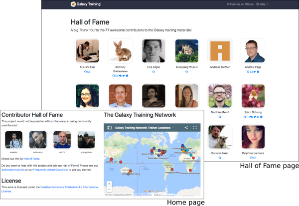

# Galaxy training material improvement and extension

### Representative: Bérénice Batut

[Introduction slides](http://bebatut.fr/talks/18/11_12_biohackathon/)

## Community
---

Galaxy community, Training platform

## Leads
---
- Bérénice Batut
- Saskia Hiltemann
- Björn Grüning

## Background information
---
[Galaxy](https://galaxyproject.org) is an open-source web framework for easy-to-use, reproducible and shareable computational life science research, with >100 public Galaxy servers. Training is an integral part of the Galaxy community. In collaboration with [GOBLET](https://www.mygoblet.org/) and the [ELIXIR Training Platform](https://www.elixir-europe.org/platforms/training), the [Galaxy Training Network](https://galaxyproject.org/teach/gtn/) is developing open, peer-reviewed and FAIR training material: >80 tutorials developed by >100 contributors, available at https://training.galaxyproject.org, to deliver training for scientists, developers and system administrators. The material is complemented by metadata to automatically populate the [ELIXIR training portal (TeSS)](https://tess.elixir-europe.org/) and to describe the technical infrastructure needed to run the tutorial (e.g. tools, data, workflows, etc.).

The project is aimed at making the contribution process as easy as possible, so that no specific knowledge or skills are required from contributors, and there are extensive [training materials about how to contribute to this project](https://galaxyproject.github.io/training-material/topics/contributing://galaxyproject.github.io/training-material/topics/contributing/)

## Motivation
---

Bioinformatics has become too central to biology to be left to specialist bioinformaticians. We believe that the domain experts (biologists, researchers, clinicians) should be empowered to analyze their own data.

There is a clear demand for online, accessible bioinformatics training, with a recent survey by [Brazas et al](http://biorxiv.org/content/early/2017/02/27/098996) that while most people currently learn bioinformatics by themselves or from colleagues, they would prefer to be learning through workshops or online e-learning courses.

## Goals and Expected outcomes
---

We have many ideas for this week, and participants can work on a wide range of topics depending on their interests:

- **Content**
  - Add new topics, new tutorials
  - Review open pull requests
  - Check and improve existing tutorials
  - Training Handbook for instructors

- **Global Infrastructure**
  - FAIRness evaluation of the training
  - Plan internationalisation and localisation support in order to make the training material available to users in their own language
  - BioSchemas support
  - Complete integration iwth the TeSS workflow annotator

- **Technical support**
  - Workflow testing
  - Docker images
  - [Interactive tours](https://crs4.github.io/Galaxy4Developers/lectures/09.galaxy_interactive_tours/)

- **Community**
  - More visibility for training events
  - Support for Instructors
  - Add your training philosophy and tips to help other instructors

## Expected audience
---

Instructors and anyone eager to develop Galaxy-related training material.

No specific knowledge or skills are required, just motivation! There are extensive [training materials](https://galaxyproject.github.io/training-material/topics/contributing://galaxyproject.github.io/training-material/topics/contributing/) that will help you to learn everything you need to know about contributing to this project, and of course many community members are present here this week and happy to help answer any questions.

## Related works and references
---

- [Galaxy Training Material website](https://training.galaxyproject.org/)

- [Cell paper about the Galaxy Training Material effort](https://www.sciencedirect.com/science/article/pii/S2405471218302308)
- [Introduction slides](http://bebatut.fr/talks/18/11_12_biohackathon/)
- [Chat with the community on Gitter!](https://gitter.im/Galaxy-Training-Network/Lobby)

## GitHub or any other public repositories of your FOSS products (if any)
---

- [Galaxy Training Material GitHub](https://github.com/galaxyproject/training-material)
- [Galaxy Github](https://github.com/galaxyproject/galaxy)

## Hackers
---

We welcome everybody to join our hackathon this week, no experience needed with Galaxy, git or training, just motivation!

**Why should you join?**

- Become part of an awesome community!
  - [Chat on Gitter](https://gitter.im/Galaxy-Training-Network/Lobby)
  - [Regular Online CoFests](https://www.galaxyproject.org/events/2018-11-gtn/)

    

- Learn about training, Galaxy, and bioinformatics
- Share your insights and knowledge with the community and help this project thrive
- Earn a place in our [Hall of Fame](https://galaxyproject.github.io/training-material/hall-of-fame); this project would not be possible without all of you who contribute!
    

